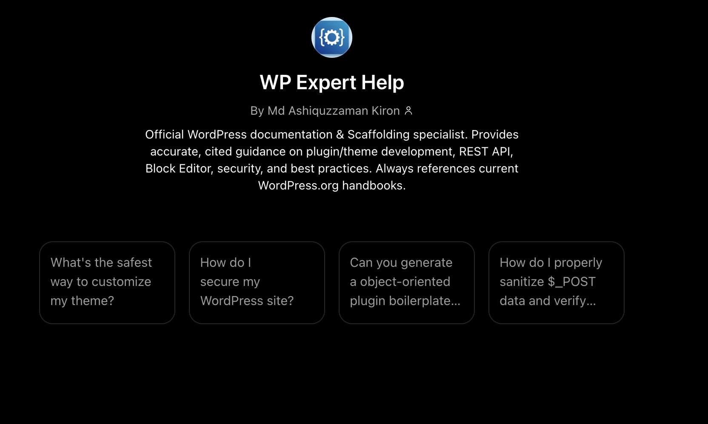

# WP Expert Help – Custom GPT for WordPress Development

>  A production-grade Custom GPT that provides expert WordPress guidance, secure plugin/theme scaffolding, and live API integrations—trained exclusively on official WordPress.org documentation.

### Screenshot one - Custom GPT app screenshot 
### Screenshot two - App logo 


 **Live GPT**: https://chatgpt.com/g/g-6a11c946898881919ef3ce634a5512ab-wp-expert-help  
📦 **License**: MIT (config) / CC0 (docs) / GPLv2+ (code)  
🛡️ **Security-First**: All generated code includes nonces, sanitization, capability checks, and ABSPATH guards

---

## ✨ Features

| Feature | Description |
|---------|-------------|
| 📚 **Cited Documentation** | Answers reference official WordPress.org handbooks with version-aware guidance |
| 🔐 **Secure Scaffolding** | Generate plugin/theme boilerplate with enforced security patterns via Code Interpreter |
| 🔍 **Live API Lookups** | Query WordPress.org plugin/theme directories for version, compatibility, and ratings |
| 🐛 **Debugging Workflows** | Step-by-step troubleshooting for WSOD, header errors, nonce failures, and conflicts |
| 🧱 **Block Editor Ready** | theme.json v3, block registration, FSE templates, and Interactivity API guidance |
| 📦 **Standards-Compliant** | All output follows WordPress Coding Standards, GPLv2+ licensing, and a11y best practices |

---

## 🚀 Quick Start

### Use the Live GPT (No Setup Required)
1. Visit: https://chatgpt.com/g/g-6a11c946898881919ef3ce634a5512ab-wp-expert-help
2. Try these prompts:
   - `How do I secure my WordPress site?`
   - `Scaffold a plugin called "Cache Helper" with an admin page`
   - `Check if WooCommerce works with WordPress 6.5`
   - `My site shows a white screen. Help!`

### Deploy Your Own Copy
1. **Fork this repo** and clone locally
2. **In GPT Builder** (requires ChatGPT Plus/Team/Enterprise):
   - Go to https://chatgpt.com/gpts → **Create** → **Configuration**
   - Paste `00-gpt-config/INSTRUCTIONS.md` into the **Instructions** field *(paste, do NOT upload)*
   - Upload all `*.md` files to the **Knowledge** section
   - Import `actions/*.yaml` schemas into the **Actions** tab via public HTTPS URLs
3. **Enable Capabilities**:
   - ✅ Code Interpreter (for scaffolding .zip generation)
   - ✅ Canvas (for side-by-side code editing)
   - ✅ Web Search (for latest WordPress news)
   - ❌ Image Generation (not needed)
4. **Publish** → Choose visibility (Private / Link / GPT Store)

---

## 📁 Repository Structure

```text
wp-expert-help/
├── 00-gpt-config/
│   └── INSTRUCTIONS.md          # GPT behavior, routing, security rules (~2,870 chars)
├── 01-core-handbooks.md         # Plugin, Theme, REST, Block Editor, WP-CLI, Advanced Admin
── 02-reference-tools.md        # Code Reference, Playground, WordPress.tv
├── 03-community-governance.md   # Licensing, contributor workflows, Core handbook
├── 04-legacy-learning.md        # Codex archive, Learn WordPress platform
── 05-source-repositories.md    # GitHub repos: Core, Gutenberg, Coding Standards
├── 06-tools-utilities.md        # LLM scrapers: wp-docs-md, wp-handbook-converter
├── 07-scaffolding-security.md   # Templates, security patterns, REST/CLI/debug/standards
├── DISCLAIMER-NOTES.md          # Legal, usage limits, maintenance protocol
├── actions/
│   ├── wordpress-org-plugin-api.yaml    # Plugin Directory API (public)
│   ├── wordpress-org-theme-api.yaml     # Theme Directory API (public)
│   ├── self-hosted-wp-rest-api.yaml     # User site REST API (Basic Auth)
│   └── github-wordpress-api.yaml        # WordPress GitHub repos (Bearer token optional)
└── README.md                    # This file
```

---

## 🗂️ GPT Builder File Mapping

| Local File | GPT Builder Destination | Purpose |
|------------|-------------------------|---------|
| `00-gpt-config/INSTRUCTIONS.md` | **Instructions** field (paste) | Defines behavior, routing, security protocol |
| `01-core-handbooks.md` | Knowledge → Upload | Core developer documentation |
| `02-reference-tools.md` | Knowledge → Upload | Code reference, Playground, WordPress.tv |
| `03-community-governance.md` | Knowledge → Upload | Licensing, contributor workflows |
| `04-legacy-learning.md` | Knowledge → Upload | Codex archive, Learn WordPress |
| `05-source-repositories.md` | Knowledge → Upload | GitHub repo references |
| `06-tools-utilities.md` | Knowledge → Upload | LLM utility documentation |
| `07-scaffolding-security.md` | Knowledge → Upload | Templates, security patterns, APIs |
| `DISCLAIMER-NOTES.md` | Knowledge → Upload | Legal, usage notes, maintenance |
| `actions/*.yaml` | Actions tab → Import from URL | Live API integrations |

**Total Knowledge Files**: 8/20 (leaves room for future updates)  
**Instructions Field**: ~2,870 characters (safe from truncation)

---

## 🔌 API Actions Overview

| Schema | Base URL | Auth | Use Case |
|--------|----------|------|----------|
| `wordpress-org-plugin-api.yaml` | `https://api.wordpress.org/plugins/info/1.2/` | None | Check plugin version, compatibility, ratings |
| `wordpress-org-theme-api.yaml` | `https://api.wordpress.org/themes/info/1.2/` | None | Browse themes, filter by tags, get preview URLs |
| `self-hosted-wp-rest-api.yaml` | `https://{site}/wp-json/wp/v2/` | Basic Auth | Create draft posts, fetch content on user's site |
| `github-wordpress-api.yaml` | `https://api.github.com` | Bearer (optional) | Read WordPress core/Gutenberg source code |

> ⚠️ **Note**: GPT Builder requires schemas to be hosted at public HTTPS URLs. Use GitHub Gists (raw), GitHub Pages, or your own server.

---

## ⚠️ Disclaimer

- This project is **not affiliated** with WordPress.org, the WordPress Foundation, or Automattic.
- Training data sourced from official WordPress.org documentation (CC0 for text, GPLv2+ for code snippets).
- Generated code is for **guidance only**—always test in a staging environment before production deployment.
- This GPT enforces security patterns but does **not replace professional security audits**.
- Report security issues responsibly via GitHub Issues.

---

## 📜 License

| Component | License |
|-----------|---------|
| Configuration files (`INSTRUCTIONS.md`, schemas) | MIT |
| Documentation content (handbook excerpts) | CC0 1.0 Universal |
| Code examples & scaffolding templates | GPLv2 or later |
| Logo & branding assets | MIT |

---

## 🔄 Maintenance Protocol

### Quarterly Updates
1. Check handbook footers at developer.wordpress.org for "Last updated" changes
2. Replace outdated sections in knowledge files
3. Update `Tested up to` versions in scaffolding templates
4. Re-test core prompts: scaffolding, API routing, security enforcement
5. Commit changes with semantic version tag (e.g., `v1.1.0`)

### Post-WordPress Release
- Validate `theme.json` schema at https://schemas.wp.org
- Update REST endpoint references if new routes added
- Refresh PHP version requirements and deprecation notices
- Test scaffolding output against new WordPress version

### Backup & Version Control
- Store all files in a private Git repository
- Use `git diff` to track knowledge file changes
- Tag releases: `git tag -a v1.0.0 -m "Initial production release"`

---

## 🤝 Contributing

1. Fork the repository
2. Create a feature branch: `git checkout -b feat/add-woocommerce-scaffolding`
3. Make changes, test locally in GPT Builder preview
4. Submit a Pull Request with:
   - Description of changes
   - Test prompts validated
   - Updated `last_updated` frontmatter if applicable

---

## 🆘 Support & Feedback

- **Bug Reports**: Open a GitHub Issue with reproduction steps
- **Feature Requests**: Use GitHub Discussions or reply `FEEDBACK:` in the live GPT
- **Security Issues**: Email responsibly (do not disclose publicly until resolved)

---

*Built for developers, by developers. Secure. Cited. Standards-compliant.* 🛡️

> 💡 **Pro Tip**: Keep `INSTRUCTIONS.md` under 3,000 characters to prevent token truncation. Offload detailed procedures to knowledge files for optimal GPT performance.
